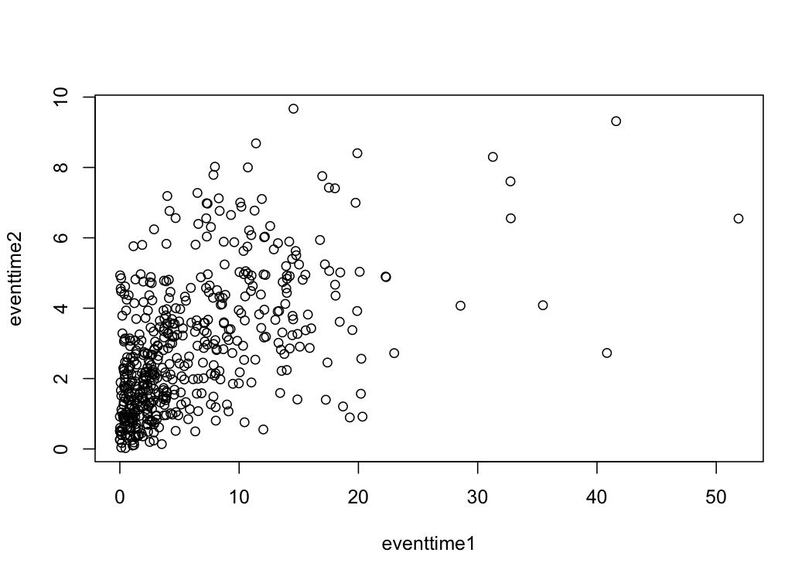

<!-- README.md is generated from README.Rmd. Please edit that file -->

# bicopula

<!-- badges: start -->

[](https://github.com/ellessenne/bicopula/actions)
[](https://codecov.io/gh/ellessenne/bicopula?branch=master)<!-- badges: end -->

## Installation

You can install the development version of {bicopula} from
[GitHub](https://github.com/) with:

``` r
# install.packages("devtools")
devtools::install_github("ellessenne/bicopula")
```

## Example

This is a basic example. Simulating some bivariate data:

``` r
library(bicopula)
#> Loading required package: survival

set.seed(42)
N <- 500
df <- data.frame(
  age = runif(N, 20, 40),
  sex = rbinom(N, size = 1, prob = 0.5),
  biomarker = runif(N, 0, 120)
)

simdata <- simulate_bisurv(
  dist1 = Exponential$new(lambda = 0.1),
  dist2 = Weibull$new(lambda = 0.1, gamma = 1.5),
  formula1 = ~ age + sex,
  formula2 = ~ age + biomarker,
  data = df,
  beta1 = c(age = 0.01, sex = 0.5),
  beta2 = c(age = 0.01, biomarker = 0.005),
  copula = copula::frankCopula(param = 5)
)

head(simdata)
#>   eventtime1 status1 eventtime2 status2
#> 1 19.9125778       1  8.4047075       1
#> 2  0.3118698       1  0.9653524       1
#> 3 17.1881459       1  5.2461692       1
#> 4  0.3472099       1  2.2786107       1
#> 5  7.2249324       1  4.5745431       1
#> 6  1.6068254       1  2.9668163       1

with(simdata, plot(eventtime1, eventtime2))
```



Then, fitting a bivariate survival model:

``` r
df <- cbind(df, simdata)

bisurvreg(
  formula1 = Surv(eventtime1, status1) ~ age + sex,
  distribution1 = "exponential",
  formula2 = Surv(eventtime2, status2) ~ age + biomarker,
  distribution2 = "weibull",
  copula = "frank",
  data = df
)
#> $par
#>  (Intercept)          age          sex  (Intercept)          age    biomarker 
#> -2.933330709  0.009289732  0.360414799 -3.047869671  0.008824681  0.004833773 
#>        theta    ancillary 
#>  4.110922938  0.448150921 
#> 
#> $objective
#> [1] 2097.916
#> 
#> $convergence
#> [1] 1
#> 
#> $iterations
#> [1] 5
#> 
#> $evaluations
#> function gradient 
#>        6        5 
#> 
#> $message
#> [1] "singular convergence (7)"
```

Lots of work needs to be done to make this *pretty*, but as a
proof-of-concept it doesn’t feel too bad!
